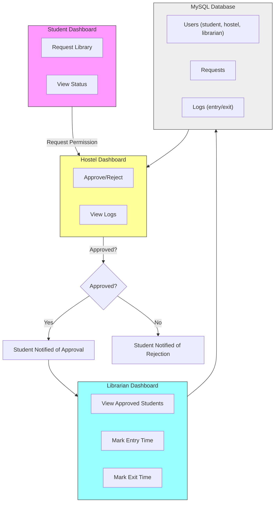

# LibTrack — High-level flow

This repository contains a simple library access tracking system. Below is a high-level flow diagram showing how students, hostel staff, and librarians interact with the system and how data is stored in the MySQL database.

If your viewer supports Mermaid diagrams (GitHub, many editors with Mermaid plugins), the diagram below will render visually. An ASCII fallback is provided for viewers that don't render Mermaid.

ASCII fallback:

		+-------------------+
		|                   |
		|   Student Dashboard|
		|                   |
		|  - Request Library |
		|  - View Status     |
		+---------+---------+
							|
							| Request Permission
							v
		+-------------------+
		|                   |
		|  Hostel Dashboard |
		|                   |
		|  - Approve/Reject |
		|  - View Logs      |
		+---------+---------+
							|
 Approved?  Yes       |       No
						+---------+---------+
						v                   v
	 +----------------+     +----------------+
	 | Student Notified|     | Student Notified
	 | of Approval     |     | of Rejection   |
	 +----------------+     +----------------+
						|
						v
	 +-------------------+
	 |                   |
	 | Librarian Dashboard|
	 |                   |
	 | - View Approved    |
	 |   Students         |
	 | - Mark Entry Time  |
	 | - Mark Exit Time   |
	 +---------+---------+
						 |
						 v
	 +------------------------+
	 |                        |
	 |   MySQL Database       |
	 |                        |
	 | - Users (student,      |
	 |   hostel, librarian)   |
	 | - Requests             |
	 | - Logs (entry/exit)    |
	 +------------------------+
						 |
						 v
	 +-------------------+
	 |                   |
	 | Hostel Dashboard  |
	 |                   |
	 | - Receives Exit   |
	 |   Time Notification|
	 | - Verify Physical |
	 |   Return           |
	 +-------------------+

Notes:
- The MySQL database stores users, requests and entry/exit logs.
- Hostel staff first approve or reject a student's request. On approval the librarian handles the physical entry/exit tracking.

Want this exported as a PNG/SVG or added as a diagram file? I can generate that next.

