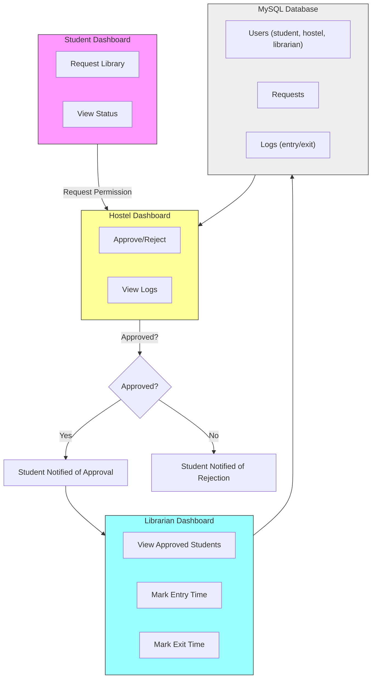

# LibTrack — High-level flow

This repository contains a simple library access tracking system. Below is a high-level flow diagram showing how students, hostel staff, and librarians interact with the system and how data is stored in the MySQL database.

If your viewer supports Mermaid diagrams (GitHub, many editors with Mermaid plugins), the diagram below will render visually. An ASCII fallback is provided for viewers that don't render Mermaid.



ASCII fallback:

		+-------------------+
		|                   |
		|   Student Dashboard|
		|                   |
		|  - Request Library |
		|  - View Status     |
		+---------+---------+
							|
							| Request Permission
							v
		+-------------------+
		|                   |
		|  Hostel Dashboard |
		|                   |
		|  - Approve/Reject |
		|  - View Logs      |
		+---------+---------+
							|
 Approved?  Yes       |       No
						+---------+---------+
						v                   v
	 +----------------+     +----------------+
	 | Student Notified|     | Student Notified
	 | of Approval     |     | of Rejection   |
	 +----------------+     +----------------+
						|
						v
	 +-------------------+
	 |                   |
	 | Librarian Dashboard|
	 |                   |
	 | - View Approved    |
	 |   Students         |
	 | - Mark Entry Time  |
	 | - Mark Exit Time   |
	 +---------+---------+
						 |
						 v
	 +------------------------+
	 |                        |
	 |   MySQL Database       |
	 |                        |
	 | - Users (student,      |
	 |   hostel, librarian)   |
	 | - Requests             |
	 | - Logs (entry/exit)    |
	 +------------------------+
						 |
						 v
	 +-------------------+
	 |                   |
	 | Hostel Dashboard  |
	 |                   |
	 | - Receives Exit   |
	 |   Time Notification|
	 | - Verify Physical |
	 |   Return           |
	 +-------------------+

Notes:
- The MySQL database stores users, requests and entry/exit logs.
- Hostel staff first approve or reject a student's request. On approval the librarian handles the physical entry/exit tracking.

Want this exported as a PNG/SVG or added as a diagram file? I can generate that next.

## Development & Run

This repo contains two main parts:

- `server/` — Express + Sequelize backend (MySQL)
- `client/` — Vite + React frontend

Quick local run (you need Node.js, npm, and Docker):

1. Start containers (MySQL + server + client build):

```powershell
docker-compose up --build
```

2. The client will be available at http://localhost:3000 and the API at http://localhost:4000.

Manual dev mode (server + client separately):

Server:

```powershell
cd server
npm install
# update .env or use environment variables 
npm run migrate # seeds example users
npm run dev
```

Client:

```powershell
cd client
npm install
npm run dev
```

Notes:
- The server expects a MySQL instance. The docker-compose file sets up MySQL on port 3306.
- This scaffold is minimal and intended as a starting point. Authentication, validation, error handling, and production hardening are left as next steps.

Requirements coverage:
- Student Dashboard: implemented in `client/src/pages/Student.jsx` (create request, view requests)
- Hostel Dashboard: implemented in `client/src/pages/Hostel.jsx` (view pending, approve/reject)
- Librarian Dashboard: implemented in `client/src/pages/Librarian.jsx` (list approved)
- MySQL models: `server/models` contains `User`, `Request`, `Log` models

Next steps I can take for you:
- Add authentication (JWT) and proper role-based access control.
- Implement notifications (email or in-app) to inform students of approval/rejection.
- Add tests and CI pipeline.


