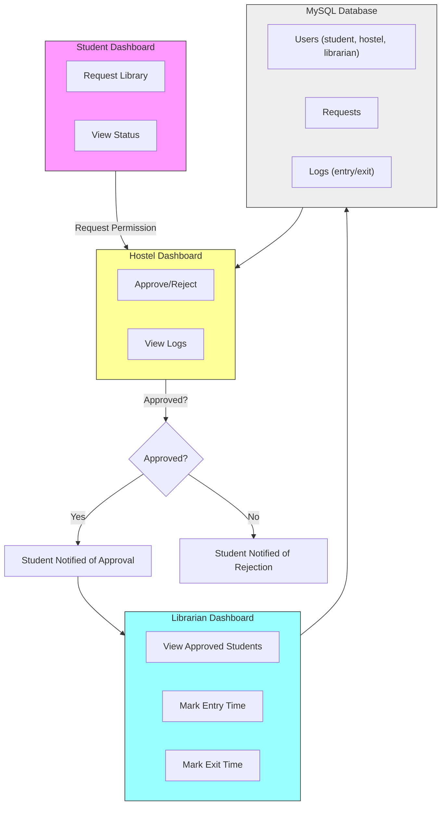

<<<<<<< HEAD
# Getting Started with Create React App

This project was bootstrapped with [Create React App](https://github.com/facebook/create-react-app).

## Available Scripts

In the project directory, you can run:

### `npm start`

Runs the app in the development mode.\
Open [http://localhost:3000](http://localhost:3000) to view it in your browser.

The page will reload when you make changes.\
You may also see any lint errors in the console.

### `npm test`

Launches the test runner in the interactive watch mode.\
See the section about [running tests](https://facebook.github.io/create-react-app/docs/running-tests) for more information.

### `npm run build`

Builds the app for production to the `build` folder.\
It correctly bundles React in production mode and optimizes the build for the best performance.

The build is minified and the filenames include the hashes.\
Your app is ready to be deployed!

See the section about [deployment](https://facebook.github.io/create-react-app/docs/deployment) for more information.

### `npm run eject`

**Note: this is a one-way operation. Once you `eject`, you can't go back!**

If you aren't satisfied with the build tool and configuration choices, you can `eject` at any time. This command will remove the single build dependency from your project.

Instead, it will copy all the configuration files and the transitive dependencies (webpack, Babel, ESLint, etc) right into your project so you have full control over them. All of the commands except `eject` will still work, but they will point to the copied scripts so you can tweak them. At this point you're on your own.

You don't have to ever use `eject`. The curated feature set is suitable for small and middle deployments, and you shouldn't feel obligated to use this feature. However we understand that this tool wouldn't be useful if you couldn't customize it when you are ready for it.

## Learn More

You can learn more in the [Create React App documentation](https://facebook.github.io/create-react-app/docs/getting-started).

To learn React, check out the [React documentation](https://reactjs.org/).

### Code Splitting

This section has moved here: [https://facebook.github.io/create-react-app/docs/code-splitting](https://facebook.github.io/create-react-app/docs/code-splitting)

### Analyzing the Bundle Size

This section has moved here: [https://facebook.github.io/create-react-app/docs/analyzing-the-bundle-size](https://facebook.github.io/create-react-app/docs/analyzing-the-bundle-size)

### Making a Progressive Web App

This section has moved here: [https://facebook.github.io/create-react-app/docs/making-a-progressive-web-app](https://facebook.github.io/create-react-app/docs/making-a-progressive-web-app)

### Advanced Configuration

This section has moved here: [https://facebook.github.io/create-react-app/docs/advanced-configuration](https://facebook.github.io/create-react-app/docs/advanced-configuration)

### Deployment

This section has moved here: [https://facebook.github.io/create-react-app/docs/deployment](https://facebook.github.io/create-react-app/docs/deployment)

### `npm run build` fails to minify

This section has moved here: [https://facebook.github.io/create-react-app/docs/troubleshooting#npm-run-build-fails-to-minify](https://facebook.github.io/create-react-app/docs/troubleshooting#npm-run-build-fails-to-minify)
=======

# LibTrack — High-level flow

This repository contains a simple library access tracking system. Below is a high-level flow diagram showing how students, hostel staff, and librarians interact with the system and how data is stored in the MySQL database.

If your viewer supports Mermaid diagrams (GitHub, many editors with Mermaid plugins), the diagram below will render visually. An ASCII fallback is provided for viewers that don't render Mermaid.



ASCII fallback:

		+-------------------+
		|                   |
		|   Student Dashboard|
		|                   |
		|  - Request Library |
		|  - View Status     |
		+---------+---------+
							|
							| Request Permission
							v
		+-------------------+
		|                   |
		|  Hostel Dashboard |
		|                   |
		|  - Approve/Reject |
		|  - View Logs      |
		+---------+---------+
							|
 Approved?  Yes       |       No
						+---------+---------+
						v                   v
	 +----------------+     +----------------+
	 | Student Notified|     | Student Notified
	 | of Approval     |     | of Rejection   |
	 +----------------+     +----------------+
						|
						v
	 +-------------------+
	 |                   |
	 | Librarian Dashboard|
	 |                   |
	 | - View Approved    |
	 |   Students         |
	 | - Mark Entry Time  |
	 | - Mark Exit Time   |
	 +---------+---------+
						 |
						 v
	 +------------------------+
	 |                        |
	 |   MySQL Database       |
	 |                        |
	 | - Users (student,      |
	 |   hostel, librarian)   |
	 | - Requests             |
	 | - Logs (entry/exit)    |
	 +------------------------+
						 |
						 v
	 +-------------------+
	 |                   |
	 | Hostel Dashboard  |
	 |                   |
	 | - Receives Exit   |
	 |   Time Notification|
	 | - Verify Physical |
	 |   Return           |
	 +-------------------+

Notes:
- The MySQL database stores users, requests and entry/exit logs.
- Hostel staff first approve or reject a student's request. On approval the librarian handles the physical entry/exit tracking.

Want this exported as a PNG/SVG or added as a diagram file? I can generate that next.

## Development & Run

This repo contains two main parts:

- `server/` — Express + Sequelize backend (MySQL)
- `client/` — Vite + React frontend

Quick local run (you need Node.js, npm, and Docker):

1. Start containers (MySQL + server + client build):

```powershell
docker-compose up --build
```

2. The client will be available at http://localhost:3000 and the API at http://localhost:4000.

Manual dev mode (server + client separately):

Server:

```powershell
cd server
npm install
# update .env or use environment variables 
npm run migrate # seeds example users
npm run dev
```

Client:

```powershell
cd client
npm install
npm run dev
```

Notes:
- The server expects a MySQL instance. The docker-compose file sets up MySQL on port 3306.
- This scaffold is minimal and intended as a starting point. Authentication, validation, error handling, and production hardening are left as next steps.

Requirements coverage:
- Student Dashboard: implemented in `client/src/pages/Student.jsx` (create request, view requests)
- Hostel Dashboard: implemented in `client/src/pages/Hostel.jsx` (view pending, approve/reject)
- Librarian Dashboard: implemented in `client/src/pages/Librarian.jsx` (list approved)
- MySQL models: `server/models` contains `User`, `Request`, `Log` models

Next steps I can take for you:
- Add authentication (JWT) and proper role-based access control.
- Implement notifications (email or in-app) to inform students of approval/rejection.
- Add tests and CI pipeline.


>>>>>>> a60d2f770d7602eebd660999287633ea27e969fb
